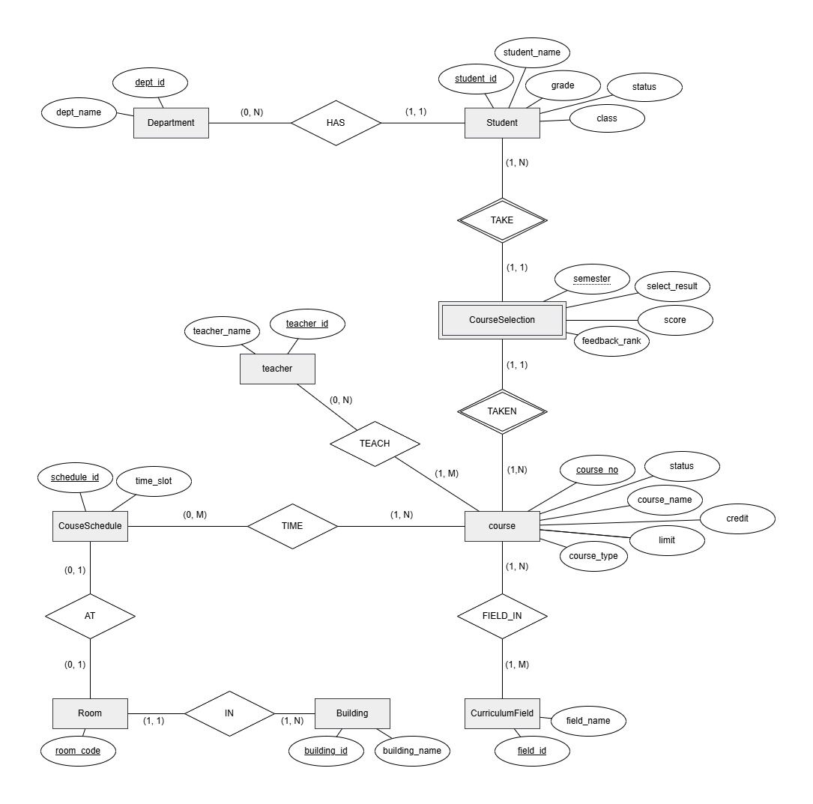

# 資料庫系統_期末專題

某校教務處記錄每位學生每學期的修課情況、該科成績、教學評量，設計了以下的資料表來儲存所需資料（列1,2,3為儲存資料參考範例）：
</br>
|#|欄位名稱|中文說明|列1|列2|列3|
|---|---|---|---|---|---|
|1|semester|學期別（1112則為111下學期）|1132|1132|1132|
|2|course_no|課程編號|A0001|A0002|A0003|
|3|course_name|課程名稱|日文|計算機概論|統計學習|
|4|course_type|選修別（必修／或選修）|選修|必修|選修|
|5|course_room|授課教室|O313|L102|M-605|
|6|course_building|授課地點|綜教館|工程五館|鴻經館|
|7|course_time|授課時間（一123：表示週一早上1-3節），一門課有多節次則以逗點隔開|一567|二34,五4|四567|
|8|course_credit|學分數|2|3|3|
|9|course_limit|課程人數限制|100|60|55|
|10|course_status|課程狀態（開課／停開）|開課|開課|開課|
|11|curriculum_field|課程領域|理論數學|人工智慧,資料科學與多媒體|財務工程,統計推論|
|12|teacher_name|授課教師姓名|岳飛|陸羽|劉邦,項羽|
|13|student_name|學生姓名|張飛|關羽|劉備|
|14|student_dept|學生系所|數學系|資訊工程系|資訊管理系|
|15|student_grade|學生年級|1|1|1|
|16|student_status|學生在學狀態（在學／休學／退學）|在學|在學|在學|
|17|student_class|學生班別|A|B|A|
|18|select_result|選課結果|中選|中選|落選|
|19|course_score|學期總成績|90|63|-|
|20|feedback_rank|教學評量結果（1-5分）|10|3|-|

* 注意：課程領域與授課教師都是多筆資訊，以逗點隔開存入。
<br>

## 題目區

如此複雜的課程相關資料，如果資料表這樣設計，資料相依性太高、資料維護不易，也浪費儲存空間！因此本次專案的目標如下：

1. 將資料表進行 3NF 或 BCNF，並將正規化後的資料表欄位結構逐項列出，內容需包括：
    > **欄位名稱**（英文命名，可自行依正規化需求自行調整及增加欄位）、<br>
    > **資料型態**（字串、整數、浮點數、日期...）、<br>
    > **相依資訊**（主鍵、外來鍵、唯一值）、<br>
    > **欄位說明**

1. 繪製出您所設計的資料表之「ER-Diagram」或「ER-Model」。
2. 用 SQL 語法解決下列事件：
   1. 「A0001日文」因為綜教館改建，上課地點要由綜教館O313修改到教研大樓A201，該怎麼做？
   2. 請設計一個方便助教點名的點名表，欄位自行定義，產出結果以「A0002 計算機概論」課程為範例。
   3. 請列出課程成績不及格的學生比例資料（大學部：低於60分、碩博：70分），產出欄位範例如下：
        |課名|授課教師|不及格人次|修課人次|不及格比例|
        |---|---|---|---|---|
    4. 請列出一張表格供教務處了解各系學生修課領域分佈情況，請依系所及佔比排序，產出欄位範例如下：
        |學生系所|課程領域|人次|佔比|
        |---|---|---|---|
    5. 請列出教學評量平均分數及總分，並依平均分數由高至低排序，產出欄位範例如下：
        |課程編號|課稱名稱|授課教師|評量總分|評量平均分數|
        |---|---|---|---|---|
3. 下列[網址](./README_file/course_data_1nf_2025.sql)為SQL格式及資料，請用您熟悉的資料庫實作資料庫正規化。 


## 解答區

1. [解答檔](./README_file/題目1解答.md)
2. 解答圖
   
   * [原始總資料](./README_file/題目2解答.xlsx)
   * [drawio資料](./README_file/題目2_ER-diagram.drawio)
3. 解答
   1. [原程式碼](./README_file/題目3_1解答.sql)
        ```sql
        -- 更新 Building 表，插入新的教室記錄（若 A201 不存在）
        INSERT INTO Building (building_id, building_name)
        SELECT 
            'B' + RIGHT('000' + CAST(COALESCE(MAX(CAST(SUBSTRING(building_id, 2, LEN(building_id)-1) AS INT)), 0) + 1 AS VARCHAR), 3),
            N'教研大樓'
        FROM Building
        WHERE NOT EXISTS (SELECT building_id FROM Building WHERE building_name = N'教研大樓');

        -- 更新 Room 表，插入新的教室記錄（若 A201 不存在）
        INSERT INTO Room (room_code, building_id)
        SELECT 
            'A201',
            building_id
        FROM Building
        WHERE building_name = N'教研大樓'
        AND NOT EXISTS (SELECT 1 FROM Room WHERE room_code = 'A201')

        UPDATE CourseSchedule
        SET room_code = 'A201'
        WHERE course_no = 'A0001' AND room_code = 'O313';
        ```
   2. [原程式碼](./README_file/題目3_2解答.sql)
        ```SQL
        SELECT 
            c.course_no AS course_id,
            c.course_name,
            s.student_id,
            s.student_name,
            d.dept_name AS department,
            '' AS attendance
        FROM CourseSelection cs
        JOIN Course c ON cs.course_no = c.course_no
        JOIN Student s ON cs.student_id = s.student_id
        JOIN Department d ON s.dept_id = d.dept_id
        WHERE cs.course_no = 'A0002'
            AND s.status='在學'
            AND cs.select_result <> '落選' 
            AND cs.semester='1132'
        ORDER BY s.student_id;
        ```
   3. [原程式碼](./README_file/題目3_3解答.sql)
        ```SQL
        WITH TeacherList AS (
            SELECT ct.course_no, t.teacher_name
            FROM CourseTeacher ct
            INNER JOIN Teacher t ON ct.teacher_id = t.teacher_id
        ),
        Middle as(
        SELECT 
            c.course_name AS '課名',
            c.course_no AS 'ID',
            SUM(CASE WHEN cs.score < 60 AND d.dept_name like '%系'THEN 1 ELSE 0 END)+SUM(CASE WHEN cs.score < 70 AND d.dept_name not like '%系'THEN 1 ELSE 0 END) AS '不及格人次',
            SUM(CASE WHEN cs.score IS NOT NULL THEN 1 ELSE 0 END) AS '修課人次',
            ROUND(
                SUM(CASE WHEN cs.score < 60 AND d.dept_name like '%系'THEN 1 ELSE 0 END)+SUM(CASE WHEN cs.score < 70 AND d.dept_name not like '%系'THEN 1 ELSE 0 END) * 100.0 / 
                NULLIF(SUM(CASE WHEN cs.score IS NOT NULL THEN 1 ELSE 0 END), 0), 
                2
            ) AS '不及格比例'
        FROM CourseSelection cs
        INNER JOIN Course c ON cs.course_no = c.course_no
        INNER JOIN Student s ON cs.student_id=s.student_id
        INNER JOIN Department d ON d.dept_id=s.dept_id
        WHERE cs.select_result <> N'落選'
        GROUP BY c.course_no, c.course_name
        HAVING SUM(CASE WHEN cs.score IS NOT NULL THEN 1 ELSE 0 END) > 0
        ),
        add_teacher_name AS(
        SELECT m.[ID],STRING_AGG(teacher_name,' / ') AS '授課老師' FROM Middle m
        JOIN  TeacherList tl ON m.ID=tl.course_no
        GROUP BY m.ID)

        SELECT m.課名,m.ID,tn.授課老師,m.不及格人次,m.修課人次,m.不及格比例 FROM Middle m 
        JOIN add_teacher_name tn ON m.ID = tn.ID
        ```
   4. [原程式碼](./README_file/題目3_4解答.sql)
        ```SQL
        WITH TotalByDept AS (
            SELECT 
                d.dept_name,
                COUNT(cs.student_id) AS total_count
            FROM CourseSelection cs
            JOIN Student s ON cs.student_id = s.student_id
            JOIN Department d ON s.dept_id = d.dept_id
            WHERE cs.select_result = '中選' OR cs.slect_result = '人工加選'
            GROUP BY d.dept_name
        )

        SELECT 
            d.dept_name AS 學生系所,
            cf.field_name AS 課程領域,
            COUNT(cs.student_id) AS 人次,
            ROUND(
                COUNT(cs.student_id) * 100.0 / t.total_count, 
                2
            ) AS 佔比
        FROM CourseSelection cs
        JOIN Student s ON cs.student_id = s.student_id
        JOIN Department d ON s.dept_id = d.dept_id
        JOIN CurriculumField cf ON cs.course_no = cf.course_no
        JOIN TotalByDept t ON d.dept_name = t.dept_name
        WHERE cs.select_result = '中選' OR cs.slect_result = '人工加選'
        GROUP BY d.dept_name, cf.field_name, t.total_count
        ORDER BY d.dept_name, 佔比 DESC;
        ```
   5. [原程式碼](./README_file/題目3_5解答.sql)
        ```SQL
        WITH UniqueTeachers AS (
            SELECT DISTINCT ct.course_no, t.teacher_name
            FROM CourseTeacher ct
            JOIN Teacher t ON ct.teacher_id = t.teacher_id
        ),
        CourseFeedback AS (
            SELECT 
                cs.course_no,
                c.course_name,
                cs.feedback_rank
            FROM CourseSelection cs
            JOIN Course c ON cs.course_no = c.course_no
            WHERE (cs.select_result = N'中選' OR cs.select_result = N'人工加選') AND cs.feedback_rank IS NOT NULL
            GROUP BY cs.course_no, c.course_name, cs.student_id, cs.feedback_rank
        ),
        AggregatedFeedback AS (
            SELECT 
                cf.course_no,
                cf.course_name,
                SUM(cf.feedback_rank) AS total_feedback,
                AVG(cf.feedback_rank * 1.0) AS avg_feedback
            FROM CourseFeedback cf
            GROUP BY cf.course_no, cf.course_name
        )
        SELECT 
            af.course_no AS 課程編號,
            af.course_name AS 課稱名稱,
            STRING_AGG(ut.teacher_name, ',') AS 授課教師,
            af.total_feedback AS 評量總分,
            ROUND(af.avg_feedback, 2) AS 評量平均分數
        FROM AggregatedFeedback af
        LEFT JOIN UniqueTeachers ut ON af.course_no = ut.course_no
        GROUP BY af.course_no, af.course_name, af.total_feedback, af.avg_feedback
        ORDER BY af.avg_feedback DESC;
        ```
4. [解答檔](./README_file/題目4解答.sql)
